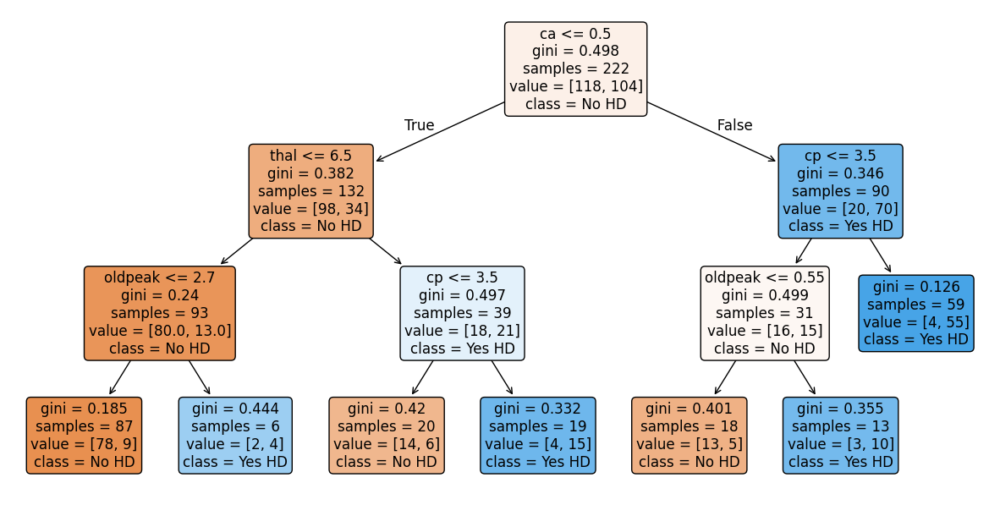
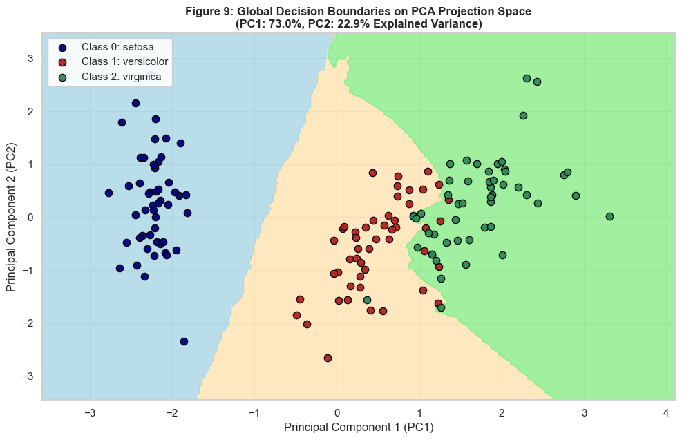
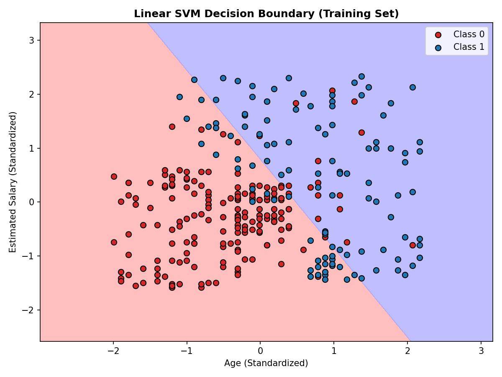
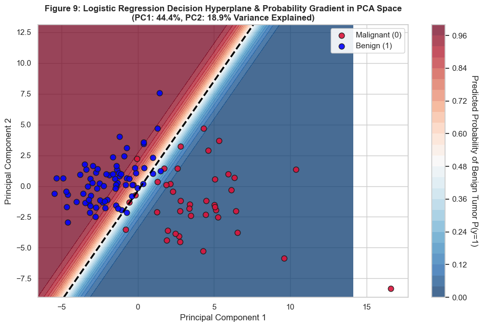
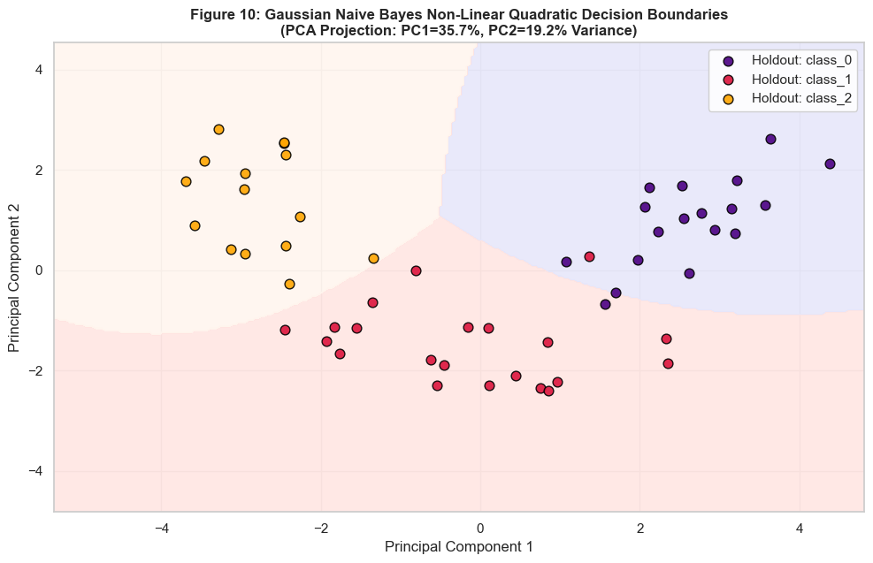
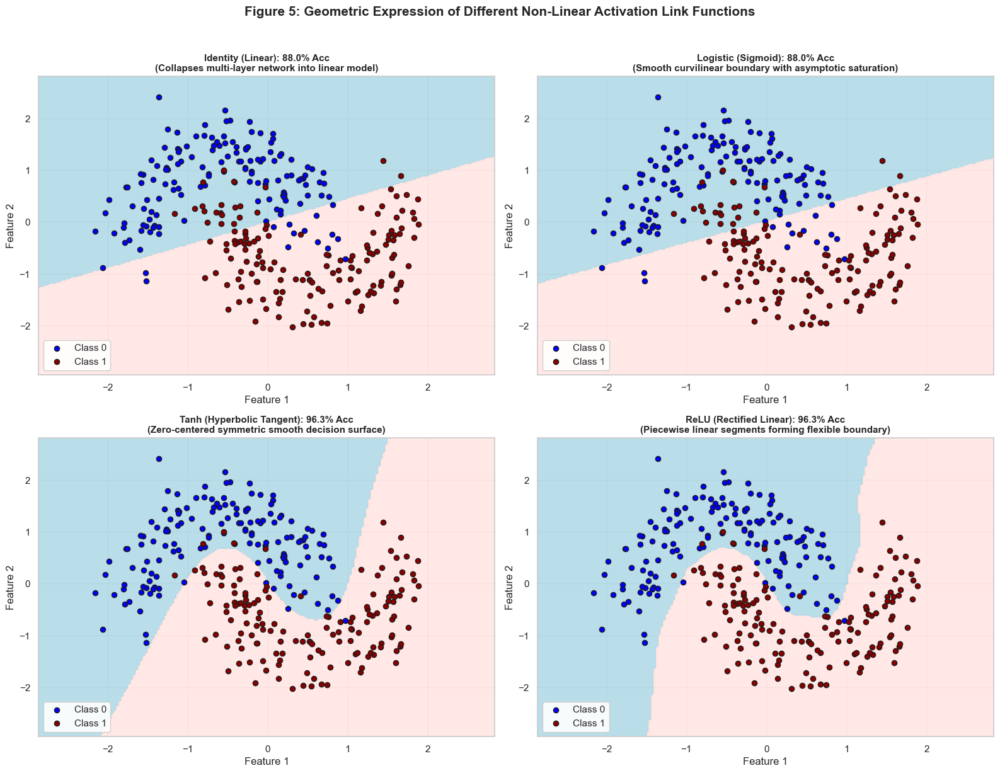
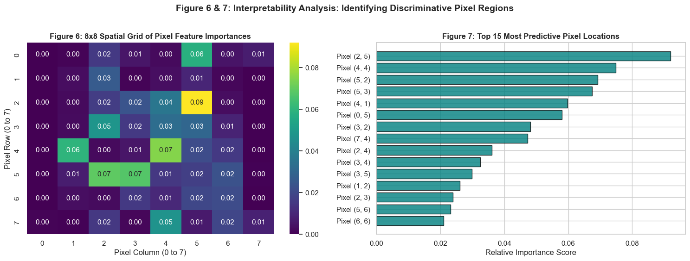
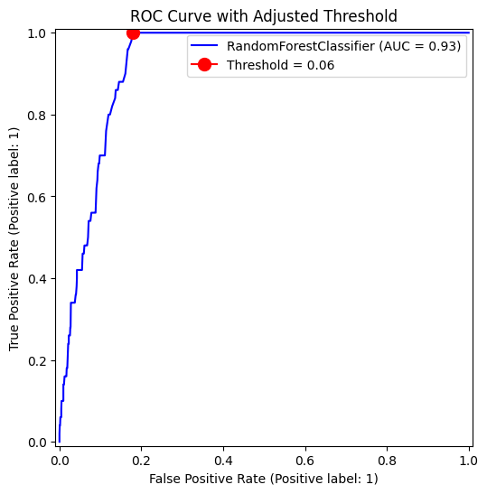

# 🧠 ML-Classification-Algorithms


[](https://scikit-learn.org/)
[](https://jupyter.org/)
[](https://pandas.pydata.org/)
[](LICENSE)


---

## 📑 Table of Contents

- [Module Catalog & Covered Algorithms](#-module-catalog--covered-algorithms)
- [Visual Highlights & Decision Frontiers](#-visual-highlights--decision-frontiers)
- [Datasets Summary](#-datasets-summary)
- [Key Workflows & Machine Learning Concepts](#-key-workflows--machine-learning-concepts)
- [Getting Started](#-getting-started)
  - [Prerequisites](#prerequisites)
  - [Environment Setup with uv](#environment-setup-with-uv)
  - [Launching Notebooks](#launching-notebooks)
  - [Running Standalone Python Scripts](#running-standalone-python-scripts)
- [Recommended Evaluation Metrics](#-recommended-evaluation-metrics)
- [License](#-license)


---

## 🔬 Module Catalog & Covered Algorithms

| # | Algorithm / Topic | Notebook / Script | Dataset | Core Focus |
|---|-------------------|-------------------|---------|------------|
| 1 | **Logistic Regression** | [`breast_cancer_logistic_regression.ipynb`](notebooks/logistic_regression/breast_cancer_logistic_regression.ipynb) | Breast Cancer Diagnostic | Binary classification, Sigmoid function, feature standardization, ROC-AUC, odds ratios. |
| 2 | **K-Nearest Neighbors (KNN)** | [`iris_knn_classification.ipynb`](notebooks/knn/iris_knn_classification.ipynb) | Iris Flower Dataset | Distance metrics (Euclidean/Manhattan), choice of $k$, decision regions, multiclass evaluation. |
| 3 | **Support Vector Machines (SVM)** | [`predict_heart_disease_svm.ipynb`](notebooks/support_vector_machines/predict_heart_disease_svm.ipynb)<br>[`svm_classification.py`](notebooks/support_vector_machines/svm_classification.py) | Cleveland Heart Disease / Social Ads | Kernel trick (Linear, RBF), hyperparameter tuning ($C, \gamma$), PCA 2D projections. |
| 4 | **Decision Trees** | [`classification_trees.ipynb`](notebooks/decision_trees/classification_trees.ipynb) | Cleveland Heart Disease | Splitting criteria (Gini/Entropy), one-hot encoding, minimal cost-complexity pruning ($\alpha$). |
| 5 | **Naive Bayes** | [`naive_bayes_wine_classification.ipynb`](notebooks/naive_bayes/naive_bayes_wine_classification.ipynb) | Wine Cultivar Dataset | Conditional independence assumption, Gaussian likelihood estimation, prior/posterior probabilities. |
| 6 | **Neural Networks (MLP)** | [`mlp_neural_network.ipynb`](notebooks/neural_networks/mlp_neural_network.ipynb) | Two Moons (`make_moons`) | Feedforward deep architecture, activation functions (ReLU, tanh), non-linear decision frontiers. |
| 7 | **Gradient Boosting** | [`gradient_boosting_digits.ipynb`](notebooks/gradient_boosting/gradient_boosting_digits.ipynb) | Optical Digits Recognition | Sequential ensemble learning, weak learners, shrinkage rate, multiclass error reduction. |
| 8 | **Imbalanced Data: Fundamentals** | [`handling_imbalanced_data.ipynb`](notebooks/imbalanced_data/handling_imbalanced_data.ipynb) | Credit Card Fraud | The accuracy paradox, random undersampling, random oversampling, PR-AUC evaluation. |
| 9 | **Imbalanced Data: SMOTE & RF** | [`creditcard_fraud_smote_rf.ipynb`](notebooks/imbalanced_data/creditcard_fraud_smote_rf.ipynb) | Credit Card Fraud | Synthetic Minority Over-sampling (SMOTE), class-weighted Random Forest, threshold optimization. |

---

## 🖼️ Visual Highlights & Decision Frontiers

A curated showcase highlighting the primary decision surface, architectural diagnostic, or learning trajectory for each classification paradigm:

| Paradigm / Algorithm | Primary Visual Demonstration | Technical Focus |
|:---|:---:|:---|
| **Decision Trees**<br>[`classification_trees.ipynb`](notebooks/decision_trees/classification_trees.ipynb) |  | **Cost-Complexity Pruning ($\alpha$)**:<br>Minimal cost-complexity pruned tree isolating root clinical split criteria without overfitting. |
| **K-Nearest Neighbors**<br>[`iris_knn_classification.ipynb`](notebooks/knn/iris_knn_classification.ipynb) |  | **PCA Decision Partitions**:<br>Tuned multi-class KNN decision regions projected onto principal components with test boundary verification. |
| **Support Vector Machines**<br>[`svm_classification.py`](notebooks/support_vector_machines/svm_classification.py) |  | **Maximum-Margin Hyperplane**:<br>Optimal linear separating hyperplane maximizing margin distance between standardized feature classes. |
| **Logistic Regression**<br>[`breast_cancer_logistic_regression.ipynb`](notebooks/logistic_regression/breast_cancer_logistic_regression.ipynb) |  | **Continuous Probability Contours**:<br>Sigmoidal posterior probability gradient surface and linear classification boundary in 2D PCA space. |
| **Naive Bayes**<br>[`naive_bayes_wine_classification.ipynb`](notebooks/naive_bayes/naive_bayes_wine_classification.ipynb) |  | **Quadratic Decision Frontiers**:<br>Non-linear class decision frontiers formed by Gaussian likelihood estimation across wine cultivar distributions. |
| **Multi-Layer Perceptron (MLP)**<br>[`mlp_neural_network.ipynb`](notebooks/neural_networks/mlp_neural_network.ipynb) |  | **Activation Function Dynamics**:<br>4-panel non-linear decision frontier comparison (Identity, Logistic, Tanh, ReLU) resolving interlocking half moons. |
| **Gradient Boosting**<br>[`gradient_boosting_digits.ipynb`](notebooks/gradient_boosting/gradient_boosting_digits.ipynb) |  | **Ensemble Feature Importance**:<br>8×8 spatial heatmap and top 15 ranking pixels driving sequential weak-learner boosting iterations. |
| **Imbalanced Learning & SMOTE**<br>[`creditcard_fraud_smote_rf.ipynb`](notebooks/imbalanced_data/creditcard_fraud_smote_rf.ipynb) |  | **Decision Threshold Calibration**:<br>ROC curve elbow calibration on SMOTE-augmented Random Forest to maximize minority fraud recall. |

---

## 📊 Datasets Summary

### Local Datasets (`data/`)

- **`creditcard.csv`**: Contains transactions made by European cardholders in Sept 2013. Highly imbalanced (fraud represents only ~0.172% of all transactions). Features $V_1 \dots V_{28}$ are PCA-transformed components, with `Time` and `Amount`.
- **`processed_cleveland.data`**: Standard 14-feature clinical dataset from the Cleveland Clinic Foundation for coronary heart disease diagnosis (`age`, `sex`, `cp`, `trestbps`, `chol`, `thalach`, etc.).
- **`svm_dataset.csv`**: 400 user records with `User ID`, `Gender`, `Age`, `EstimatedSalary`, and target label `Purchased` (0 or 1).
- **`customers.csv` / `customers.xlsx`**: Customer segmentation data with `CustomerID`, `Gender`, `Age`, `AnnualSalary(k$)`, and `Spendings(1-100)`.

### Scikit-Learn Built-in Datasets

- **Breast Cancer Wisconsin (Diagnostic)**: 569 instances, 30 continuous features computed from digitized FNA images of breast masses.
- **Iris Plants Dataset**: 150 instances, 4 morphological features, 3 target flower classes.
- **Wine Recognition Dataset**: 178 instances, 13 chemical constituents from wines derived from 3 different cultivars.
- **Optical Recognition of Handwritten Digits**: 1,797 8x8 normalized pixel images representing digits 0 through 9.
- **Make Moons**: Synthetic two-interleaving half circles to test non-linear separability.

---

## ⚙️ Key Workflows & Machine Learning Concepts

1. **Preprocessing & Scaling**:
   - Continuous features are normalized with `StandardScaler` to prevent feature dominance in distance-sensitive models (KNN, SVM, MLP).
   - Missing indicators (`?`) are parsed, imputed, or cleaned appropriately.
   - Categorical variables are converted with `pd.get_dummies()` for tree and linear classifiers.

2. **Hyperparameter Tuning & Regularization**:
   - `GridSearchCV` with Stratified $K$-Fold Cross-Validation ensures robust hyperparameter selection without data leakage.
   - Cost-complexity pruning paths ($\alpha$) for decision trees prevent overfitting while maintaining interpretability.

3. **Imbalanced Classification Strategies**:
   - Application of **SMOTE** (`imblearn.over_sampling.SMOTE`) generates realistic synthetic minority points in feature space.
   - Precision-Recall curves and decision threshold tuning ($0.5 \rightarrow \text{optimal } t$) balance false positives against costly false negatives.

4. **Visual Decision Boundary Analysis**:
   - Custom 2D meshgrid contour plots visualize how linear hyperplanes, non-linear kernels, and deep MLP boundaries segment feature space.

---

## 🚀 Getting Started


### Environment Setup with uv

1. **Clone the repository**:
   ```bash
   git clone https://github.com/mohd-faizy/24P_ML-Classification-Algorithms.git
   ```

2. **Create a virtual environment with `uv`**:
   ```bash
   uv venv
   ```
   *(By default, this creates a `.venv` directory in your project root.)*

3. **Activate the virtual environment**:
   - **On Windows (PowerShell)**:
     ```powershell
     .venv\Scripts\Activate.ps1
     ```
   - **On Windows (Command Prompt)**:
     ```cmd
     .venv\Scripts\activate.bat
     ```
   - **On macOS / Linux**:
     ```bash
     source .venv/bin/activate
     ```

4. **Install dependencies with `uv`**:
   ```bash
   uv pip install -r requirements.txt
   ```

---

## 📈 Recommended Evaluation Metrics

When evaluating classification models across standard and skewed datasets:

$$\text{Accuracy} = \frac{TP + TN}{TP + TN + FP + FN}$$

$$\text{Precision} = \frac{TP}{TP + FP} \quad\text{— Useful when false positives are costly}$$

$$\text{Recall (Sensitivity)} = \frac{TP}{TP + FN} \quad\text{— Critical for medical diagnosis and fraud}$$

$$\text{F1-Score} = 2 \times \frac{\text{Precision} \times \text{Recall}}{\text{Precision} + \text{Recall}} \quad\text{— Harmonic mean for imbalanced data}$$

$$\text{ROC-AUC and PR-AUC} \quad\text{— Threshold-independent discrimination power}$$

---
## ⚖️License 

This repository is licensed under the [MIT License](LICENSE) See the LICENSE file for complete details.


---

## 🔗 Connect with Me

<div align="center">

[](https://twitter.com/F4izy)
[](https://www.linkedin.com/in/mohd-faizy/)
[](https://ai.stackexchange.com/users/36737/faizy)
[](https://github.com/mohd-faizy)

</div>
